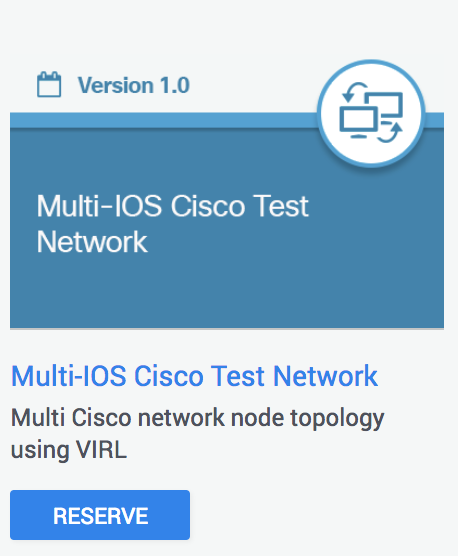

# Step 1. Introduction to Genie


Genie is a Python library solution for PyATS which contains all the tools needed for Network Test Automation. Genie bundled with the modular architecture of the PyATS framework accelerates and simplifies development of network test automation, while leveraging all the perks of the Python programming language and promoting the development of agnostic libraries. Genie is redefining how network test scripters interact with devices through libraries and avoiding functional programming.

Genie is used internally within Cisco for automating network testing and has also been released externally through Cisco DevNet. This means that the same tests which are used internally at Cisco during product development can also be executed externally on a customer setup. This is massive news for automation within and outside of Cisco!


## Objectives

In this learning lab you are going to:

* Learn about the benefits of Genie
* Launch a VIRL simulation Genie testbed to be used for all Genie DevNet labs
* Install Genie Packages
* Connect to a device using Genie via CLI
* Review the Genie PyPI packages and GitHub repositories


## Prerequisites

Successfuly completion of lab [intro-to-pyats](https://github.com/CiscoDevNet/pyats-labs/tree/master/labs/intro-to-pyats)

To run this lab we recommend reserving the Multi-IOS Cisco Test Network Sandbox from [DevNet Sandbox Remote Labs](https://devnetsandbox.cisco.com/RM/Topology)



For more information about the sandbox labs visit: https://developer.cisco.com/site/sandbox/

**NOTE: When selecting your VIRL simulation devices, ensure you select "none" for number of nodes.**

After you've received an email confirming your sandbox reservation and VPN into the Sandbox, we recommend doing the following

1. SSH to the devbox using password `C1sco12345` as the password credential

```
ssh developer@10.10.20.20
```

2. Add the `admin` account to the docker groups using the following command:

```
sudo usermod -aG docker admin
```

**NOTE: You will need to logout and log back in for this change to take effect.***


## Genie Key Features

### Plug & Play Framework

* Datafile driven testcases
* Event-driven automation
* Flexibility to create testcases by combining triggers and verifications directly into pyATS as testcases and sections.
* [Readily Available Genie Triggers](https://pubhub.devnetcloud.com/media/pyats-packages/docs/genie/genie_libs/#/triggers)
* [Readily Available Genie Verifications](https://pubhub.devnetcloud.com/media/pyats-packages/docs/genie/genie_libs/#/verifications)

### Feature Centric Object Models

* Harmonized, agnostic Python models representing network features such as BGP, OSPF, VxLAN etc.
* [Genie Python models](https://pubhub.devnetcloud.com/media/pyats-packages/docs/genie/genie_libs/#/models)

### Agnostic libraries for reusable, scalable automation

* Common validation platform
* Development effort is focussed towards writing agnostic test libraries
* Genie works across multiple management interfaces such as CLI, XML, Netconf, Restconf and others
* Shields the user from explicit CLI/YANG-RPCs by using the Cisco-shared OS/platform agnostic `abstract` package

### Robot Compatible

* What is Robot?

[RobotFramework](http://robotframework.org/) is a generic Python/Java test automation framework that focuses on acceptance test automation using English-like easy-to-use `keywords` to define testcases. Robot's testing capabilities can be extended by creating new higher-level `keywords` from existing ones that use the same syntax.

Genie, PyATS and Unicon packages have been enhanced to support `keywords` that can be used with RobotFramework. These `keywords` have been made available through the optional robot sub-package `genie.libs.robot` under the `genie.libs` namespace umbrella and the `pyats.robot` sub-package under PyATS. This enables RobotFramework users to leverage key aspects of Genie and PyATS without having to reinvent the wheel.

* Supported Robot Keywords:
	- [Genie Robot Keywords](https://pubhub.devnetcloud.com/media/pyats-packages/docs/genie/robot.html)
	- [PyATS Robot Keywords](https://pubhub.devnetcloud.com/media/pyats/docs/robot.html)
	- [Unicon Robot Keywords](https://pubhub.devnetcloud.com/media/pyats-packages/docs/unicon/robot.html)

* Documentation:
	- [Genie Robot Documentation](https://pubhub.devnetcloud.com/media/pyats-packages/docs/genie/robot/index.html)
	- [PyATS Robot Documentation](https://pubhub.devnetcloud.com/media/pyats/docs/robot/index.html)
	- [Unicon Robot Documentation](https://pubhub.devnetcloud.com/media/pyats-packages/docs/unicon/robot/index.html)


## High-Level Features

* Agnostic: Relies on the `genie.abstract` package to make Genie interoperable and work seamlessly over various OS, platform and communication protocol.
* Dynamic: Genie automatically locates the topology, configuration, and operational state of the OS to construct the essential feature/platform/interface objects.
* Efficient: Genie drastically reduces run times and development time.
* Parser independent: Using the `genie.metaparser` package, Genie is completely independent from the backend parser libraries (CLI/XML/Netconf/REST etc.).
* Portable and Flexible: Genie is entirely deployable on any testbed, it seamlessly handles diverse topologies and configurations.
* YANG Compatible: Wherever possible, Genie Conf and Genie Ops follow the YANG model structure to provide a robust, ready-to-use, set of libraries for YANG-based testing.
* Extensible: The low coupling, modularity and high cohesion properties of Genie makes it prefect infrastructure for feature, and web application testing.


## Genie Documentation

For more details, refer to the [Genie documentation](https://pubhub.devnetcloud.com/media/pyats-packages/docs/genie/index.html)


#### Next Step: Launch Genie VIRL simulation
