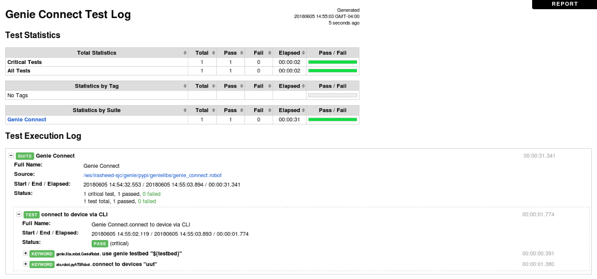
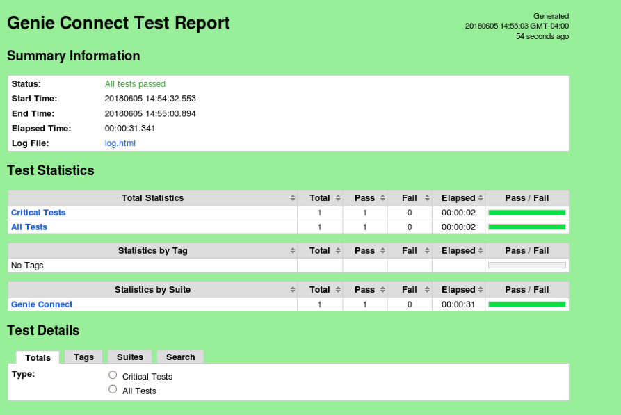

## Step 5. Using Genie to connect to a device


1. Navigate to the /genie_tests folder and use an editor to view the script `genie_connect.robot`

```
cd /genie_tests
vim genie_connect.robot
```


2. Examine the contents of the script `genie_connect.robot`

```
# Genie Devnet Lab-1: Connect to a device using CLI
# =================================================


*** Settings ***
Library        ats.robot.pyATSRobot
Library        genie.libs.robot.GenieRobot
Library        unicon.robot.UniconRobot


*** Variables ***
# Defining variables that can be used elsewhere in the test data.
${testbed}     /genie_tests/default_testbed.yaml


*** TestCases ***
# Creating testcases using available Genie, PyATS & Unicon keywords


# Connect to a device using CLI as the communication protocol
connect to device with CLI
    use genie testbed "${testbed}"
    connect to devices "uut"
```

This is a simple script to connect to the `uut` device in the testbed via CLI using Genie. The overall script can be broken down into 3 main sections:

- Libraries:

We define the libraries at the top of the script that are needed to for Genie/PyATS/Unicon RobotFramework:

* `ats.robot.pyATSRobot`:
	- Used run PyATS AEtest testcases using specific PyATS Robot keywords and converting results to Robot
	- Also used to load and use pyATS testbed topology YAML files

* `genie.libs.robot.GenieRobot`:
	- Used to run Genie Triggers & Verifications using specific Genie Robot keywords and convert the results to Robot
	- In this example however, we are only demonstrating how to connect to a device

* `unicon.robot.UniconRobot`:
	- Used to connect to a device and execute/configure commands using specific Unicon Robot keywords

- Variables

The next section contains variables that will be referenced by the testcases below. In the example above, we define the `testbed` variable to be used by the testcases below.

- TestCases

In this section we add testcases based on a combination of Genie, PyATS and Unicon Robot Keywords.


3. Run this script by executing the following command and examine the output

```
(pyats) root@cd999d662bb6:/genie_tests# robot genie_connect.robot
==============================================================================
Genie Connect
==============================================================================
connect to device with CLI                                            | PASS |
------------------------------------------------------------------------------
Genie Connect                                                         | PASS |
1 critical test, 1 passed, 0 failed
1 test total, 1 passed, 0 failed
==============================================================================
Output:  /genie_tests/output.xml
Log:     /genie_tests/log.html
Report:  /genie_tests/report.html
```

The log.html file can be viewed using any browser and contains detailed step-by-step logs of each test executed:



The report.hml file can be viewed with any browser and contains a summary of the tests executed:



Genie is capable of connecting to a device via a multitude of communication protocols such as CLI, XML, NETCONF, REST etc. The example above demonstrates the ease with which we can connect to a device using CLI.


#### Next Step: PyPI and GitHub Overview
