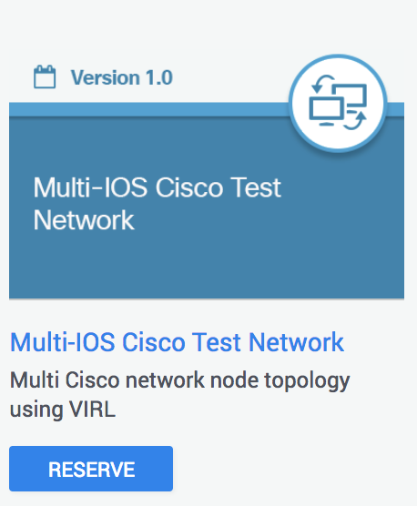

# Step 1. Introduction to pyATS

pyATS is an end-to-end testing ecosystem, specializing in data-driven and reusable testing, engineered to empower Agile and rapid development iterations. Extensible by design, pyATS enables developers to start with small, simple and linear test cases and easily scale towards large, complex


## Objectives

In this learning lab you are going to

* Learn about the benefits of pyATS
* Review some sample test cases
* Execute your first pyATS test job


## Prerequisites

To run this lab we recommend reserving the Multi-IOS Cisco Test Network Sandbox from
[DevNet Sandbox Remote Labs](https://devnetsandbox.cisco.com/RM/Topology)




For more information about the sandbox labs visit: https://developer.cisco.com/site/sandbox/

After you've received an email confirming your sandbox reservation, we recommend doing the following

1. SSH to the devbox using `admin/admin` credentials

  ```
  ssh admin@10.10.20.20
  ```

1. Add the `admin` account to the docker groups using the following command:

  ```
  sudo usermod -aG docker admin
  ```

## pyATS features

### Plug & Play Framework

* Highly extensible & plugin-friendly core framework
* Start small - comes out of the box with a predefined set of necessities
* Scale big - easily add functionality where you need through custom plugins and hooks

### Platform Agnostic

* Multi vendor & platform support achived through plugins and polymorphic interfaces
* Accelerate development-to-deployment process by eliminating duplication of boilerplate coding
* Proven track record - used in multiple product testing, ranging from web apps to enterprise routing platforms

### Data-Driven & Reusable Tests

* Write test cases that you can easily re-use, inherit, extend & scale
* Drive your tests with different topologies, parameters & datasets - expand your test coverage with the same test suites
* Take control of your automation: pick tests by id or groups, run in sequence or in parallel


#### Next Step: Launch your simulation
